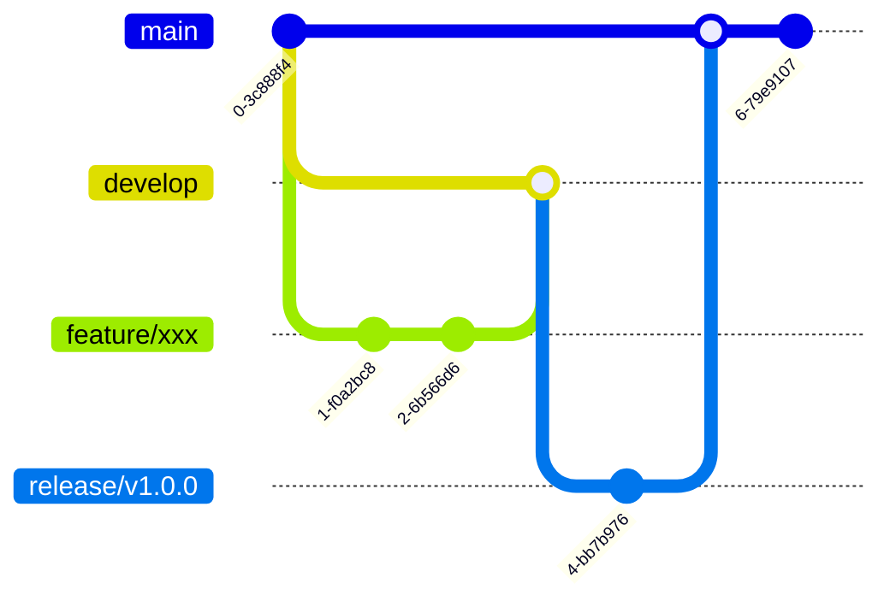
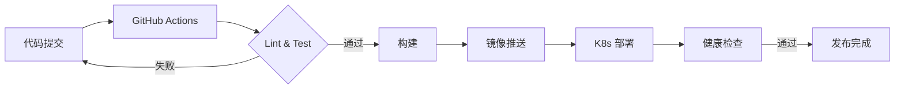

---
file: dev-guide.md
description: YYC³ 智能教育平台开发者指南 — 环境配置、开发流程、最佳实践全览
author: YanYuCloudCube Team <admin@0379.email>
version: v2.0.0
created: 2026-07-12
updated: 2026-07-12
status: stable
tags: [guide],[development],[workflow]
category: guide
language: zh-CN
audience: developers
complexity: intermediate
---

# YYC³ 智能教育平台 · 开发者指南

<div align="center">


</div>

---

## 📋 目录

- [环境准备](#环境准备)
- [项目架构](#项目架构)
- [开发流程](#开发流程)
- [代码规范](#代码规范)
- [测试体系](#测试体系)
- [构建部署](#构建部署)
- [最佳实践](#最佳实践)

---

## 1. 环境准备

### 1.1 必需工具

| 工具 | 版本要求 | 用途 | 安装方式 |
|------|---------|------|----------|
| **Node.js** | >= 18.18 | JavaScript 运行时 | [官网下载](https://nodejs.org/) / `nvm install 18` |
| **pnpm** | >= 9.0 (推荐 10.x) | 包管理器 | `npm install -g pnpm` |
| **Git** | >= 2.40 | 版本控制 | [官网下载](https://git-scm.com/) |
| **VS Code** | 最新 | IDE | [官网下载](https://code.visualstudio.com/) |
| **Docker** | >= 24.0 | 容器化开发 | [Docker Desktop](https://www.docker.com/products/docker-desktop/) |
| **Ollama** | 最新 | 本地 AI 推理 | [ollama.ai](https://ollama.ai/) |

### 1.2 VS Code 推荐插件

```json
{
  "recommendations": [
    "dbaeumer.vscode-eslint",
    "esbenp.prettier-vscode",
    "bradlc.vscode-tailwindcss",
    "dsznajder.es7-react-js-snippets",
    "christian-kohler.path-intellisense",
    "formulahendry.auto-rename-tag",
    "github.vscode-github-actions",
    "ms-azuretools.vscode-docker"
  ]
}
```

### 1.3 快速开始

```bash
# 克隆仓库
git clone https://github.com/YanYuCloudCube/YYC3-Edu-Basic.git
cd YYC3-Edu-Basic

# 安装依赖
pnpm install

# 启动开发环境
pnpm dev          # Next.js 开发服务器 (http://localhost:3000)
pnpm storybook    # Storybook 组件探索 (http://localhost:6006)

# 运行测试
pnpm test         # 单元测试（交互模式）
pnpm lint         # ESLint 代码检查

# 构建
pnpm build        # 生产构建
```

---

## 2. 项目架构

### 2.1 分层架构

```
┌─────────────────────────────────────────────────────────────┐
│                    应用层 (App Router)                       │
│  app/page.tsx → app/layout.tsx → 路由页面                   │
├─────────────────────────────────────────────────────────────┤
│                    组件层 (Components)                       │
│  components/ui/*   →  shadcn/ui 基础组件                    │
│  components/*.tsx  →  业务组件                              │
├─────────────────────────────────────────────────────────────┤
│                    Hooks 层 (Custom Hooks)                   │
│  hooks/use-*.ts   →  状态逻辑复用                           │
├─────────────────────────────────────────────────────────────┤
│                    服务层 (Services)                         │
│  lib/*            →  API 调用、工具函数                      │
│  config/*          →  应用配置                              │
├─────────────────────────────────────────────────────────────┤
│                    基础设施 (Infrastructure)                 │
│  Zustand (状态) → Docker/K8s (部署) → Postgres (数据)      │
└─────────────────────────────────────────────────────────────┘
```

### 2.2 核心目录职责

| 目录 | 职责 | 规范 |
|------|------|------|
| `app/` | Next.js 14+ App Router 路由页面 | 文件即路由，`page.tsx` 为页面入口 |
| `app/api/` | API 路由 | RESTful 风格，`route.ts` 为接口文件 |
| `components/ui/` | shadcn/ui 基础 UI 组件 | 无状态纯展示，按原子设计分类 |
| `components/` | 业务组件 | PascalCase 命名，单一职责 |
| `hooks/` | 自定义 Hooks | `useXxx` 命名，关注点分离 |
| `lib/` | 工具函数/服务 | 纯函数优先，无副作用 |
| `config/` | 应用配置 | 环境变量驱动，可分环境 |
| `public/` | 静态资源 | SVG/PNG 图标、字体文件 |

---

## 3. 开发流程

### 3.1 标准开发循环 (PDCA+)

```
┌──────────────────────────────────────────────────────────────┐
│                    YYC³ 开发循环 (PDCA+)                      │
├──────────────────────────────────────────────────────────────┤
│                                                               │
│   Plan (规划)                                                 │
│   ├─ 明确任务目标和验收标准                                     │
│   ├─ 分析影响范围和依赖关系                                     │
│   ├─ 制定实施方案和技术选型                                     │
│                         ↓                                     │
│   Do (执行)                                                   │
│   ├─ 按计划逐步实施                                            │
│   ├─ 遵循代码规范和命名标准                                     │
│   ├─ 关键操作前先确认                                           │
│                         ↓                                     │
│   Check (检查)                                                │
│   ├─ 运行 pnpm lint                                            │
│   ├─ 运行 pnpm test                                            │
│   ├─ 运行 pnpm build (构建验证)                                │
│                         ↓                                     │
│   Act (处理)                                                  │
│   ├─ 通过 → 提交代码，创建 PR                                  │
│   ├─ 不通过 → 分析原因，制定修复方案                             │
│                         ↓                                     │
│   Archive (归档)                                              │
│   ├─ 同步更新 docs/ 项目文档                                   │
│   ├─ 更新 CHANGELOG                                           │
│   └─ 确保下次可衔接                                           │
│                                                               │
└──────────────────────────────────────────────────────────────┘
```

### 3.2 Git 工作流



**提交规范 (Conventional Commits)**:

```
<type>(<scope>): <description>

类型: feat | fix | docs | style | refactor | perf | test | chore
范围: component | hook | api | config | docs | deps

示例:
feat(ai): 新增 DeepSeek 模型对话接口
fix(ui): 修复 Dialog 组件在移动端关闭异常
docs(readme): 更新技术栈徽章与架构图
deps: 升级 next@15.5.20 react@19.2.7
```

### 3.3 分支策略

| 分支 | 用途 | 来源 | 合并到 |
|------|------|------|--------|
| `main` | 生产分支 | - | - |
| `develop` | 开发主线 | `main` | `main` |
| `feature/*` | 功能开发 | `develop` | `develop` |
| `bugfix/*` | 缺陷修复 | `develop` | `develop` |
| `release/*` | 发布准备 | `develop` | `main` + `develop` |
| `hotfix/*` | 紧急修复 | `main` | `main` + `develop` |

---

## 4. 代码规范

### 4.1 代码标头

```typescript
/**
 * file: component-name.tsx
 * description: 组件的简要描述（不超过 50 字）
 * author: YanYuCloudCube Team
 * version: v1.0.0
 * created: YYYY-MM-DD
 * updated: YYYY-MM-DD
 * status: active
 * tags: [component],[function]
 *
 * brief: 简要说明（不超过 100 字）
 * dependencies: React, shadcn/ui
 * notes: 注意事项
 */
```

### 4.2 命名规范

| 类别 | 规范 | 示例 |
|------|------|------|
| 组件文件 | PascalCase | `DataMonitoring.tsx` |
| Hook 文件 | camelCase | `useI18n.ts` |
| 工具函数 | camelCase | `formatDate.ts` |
| 样式文件 | kebab-case | `global-styles.css` |
| 配置文件 | kebab-case | `tailwind.config.js` |

### 4.3 ESLint + Prettier

```bash
# 代码检查
pnpm lint

# 自动修复
pnpm lint --fix
```

> 项目已配置 TypeScript Strict 模式 + ESLint 9.x，提交前自动执行 husky + lint-staged。

---

## 5. 测试体系

### 5.1 测试金字塔

```
        ⬆
      /    \        E2E 测试 (Playwright)
    /────────\      └ 关键用户流程
  /────────────\    集成测试 (Vitest)
 /───────────────\  └ 组件交互、API 路由
/──────────────────\ 单元测试 (Vitest + Jest)
├── 工具函数 ├── Hooks ├── 组件渲染 ┤
```

### 5.2 测试命令

```bash
# 运行所有测试
pnpm test

# 运行 Vitest 单元/组件测试
pnpm vitest

# 运行 Storybook 组件测试
pnpm storybook

# 运行 Playwright E2E 测试
npx playwright test
```

### 5.3 覆盖率目标

| 层级 | 目标 | 工具 |
|------|------|------|
| 单元测试 | >= 90% | Vitest + Jest |
| 组件测试 | >= 80% | Storybook + Vitest |
| E2E 测试 | 核心流程 | Playwright |

---

## 6. 构建部署

### 6.1 构建管道



### 6.2 部署策略

| 环境 | 方式 | 触发条件 |
|------|------|----------|
| 开发 | `pnpm dev` | 本地启动 |
| 预览 | Vercel Preview | PR 创建 |
| 测试 | Docker Compose | 手动触发 |
| 生产 | K8s 滚动更新 | main 分支推送 |

---

## 7. 最佳实践

### 7.1 组件设计原则

- **单一职责**：每个组件只做一件事
- **组合优于继承**：使用 shadcn/ui + Radix 原语组合
- **状态提升**：共享状态提升到最近公共祖先
- **Server Component 优先**：仅在需要交互时使用 Client Component

### 7.2 性能优化

- 使用 `next/image` 优化图片加载
- 组件懒加载：`next/dynamic`
- 数据缓存：`fetch` 的 `cache` 选项
- 字体优化：`next/font` (Geist Sans/Mono)

### 7.3 安全规范

- 🔒 敏感信息使用环境变量 (`.env.local`)
- 🔒 API Key 不硬编码
- 🔒 用户输入必须 Zod 校验
- 🔒 XSS 防护：使用 `dangerouslySetInnerHTML` 前必须 sanitize

### 7.4 文档同步

每次代码变更，同步更新：

1. **README.md** — 功能描述、技术栈、架构图
2. **docs/dev-guide.md** — 开发流程、最佳实践
3. **docs/tech-stack.md** — 技术选型与版本
4. **组件 Storybook** — 组件文档与交互示例

---

<div align="center">

> **「YYC³ · 言启千行代码，语枢万物智能」**
>
> *© 2025-2026 YYC³ Team. All Rights Reserved.*

</div>
